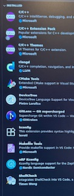

# Linux Kernel Development

## Development Environment

### Assumptions:  
- gdb, qemu, and busybox are installed on Linux from Scratch (LFS) host.

### FYIs:
- GDB is the C++ debugger  
- QEMU is the tool where you can run the a Linux VM that has the kernel updates  
- QEMU and GDB kernel settings that need to be in place for LFS host kernel are shown below.
- Visual Studio Code plugins shown later on page.

### Steps:      

0. Open Visual Studio Code (VSC)
1. Open official linux GitHub project in VSC
2. `make mrproper`
3. `make x86_64_defconfig`
4. Using a VSC terminal, build a quick .config with no changes to default settings.
5. Create a bash script called something like modify-config.sh.  Once run, it will append the lines below to your .config.  

        cat >> .config <<'EOF'
        #
        # --- Core Debug Information ---
        #
        CONFIG_EXPERT=y                      # Expose advanced options in menuconfig
        CONFIG_DEBUG_KERNEL=y                # Enable kernel debugging features
        CONFIG_DEBUG_INFO=y                  # Include debug info in vmlinux
        CONFIG_DEBUG_INFO_DWARF_TOOLCHAIN_DEFAULT=y
        CONFIG_DEBUG_INFO_DWARF5=y           # Use DWARF5 for modern GDB (smaller, faster)
        # CONFIG_DEBUG_INFO_NONE is not set  # Ensure we don't disable debug info
        # CONFIG_DEBUG_INFO_REDUCED is not set
        CONFIG_FRAME_POINTER=y               # Keep frame pointers for clearer backtraces
        CONFIG_GDB_SCRIPTS=y                 # Generate GDB helper scripts
        
        #
        # --- Symbol Tables ---
        #
        CONFIG_KALLSYMS=y                   # Include kernel symbol table
        CONFIG_KALLSYMS_ALL=y               # Include all symbols, not just global
        CONFIG_STRIP_ASM_SYMS=n             # Don’t remove assembler symbols
        CONFIG_DEBUG_FS=y                   # Enable /sys/kernel/debug
        
        #
        # --- Boot & Early Logging ---
        #
        CONFIG_EARLY_PRINTK=y               # Show printk output during early boot
        CONFIG_EARLYCON=y                   # Enable early console (works with console=ttyS0)
        CONFIG_PRINTK_TIME=y                # Show timestamps in kernel logs
        
        #
        # --- Safety & Diagnostic Checks ---
        #
        CONFIG_BUG=y                        # Enable BUG() / WARN() reporting
        CONFIG_DEBUG_OBJECTS=y              # Detect use-after-free / bad refs
        CONFIG_DEBUG_SLAB=y                 # Catch bad memory allocations
        CONFIG_DEBUG_SPINLOCK=y             # Detect bad spinlock usage
        CONFIG_DEBUG_STACKOVERFLOW=y        # Detect stack overflows
        CONFIG_DEBUG_PAGEALLOC=y            # Detect use-after-free in pages
        CONFIG_PANIC_ON_OOPS=y              # Panic on kernel oops for reproducibility
        
        #
        # --- Virtualization (for QEMU/KVM testing) ---
        #
        CONFIG_VIRTUALIZATION=y             # Enable virtualization menu
        CONFIG_KVM=y                        # Kernel-based Virtual Machine core support
        CONFIG_KVM_INTEL=y                  # KVM for Intel CPUs
        CONFIG_KVM_AMD=y                    # KVM for AMD CPUs
        CONFIG_VHOST_NET=y                  # Virtio network backend for QEMU (optional)
        CONFIG_VHOST=y                      # Generic host-level virtualization driver
        
        #
        # --- Networking Core ---
        #
        CONFIG_NET=y                        # Enable networking subsystem
        CONFIG_NETDEVICES=y                 # Enable network device support
        CONFIG_NET_CORE=y                   # Core network drivers and interfaces
        CONFIG_TUN=y                        # Universal TUN/TAP virtual network device
        CONFIG_BRIDGE=y                     # 802.1d Ethernet bridging (for virtual LANs)
        
        #
        # --- Optional Convenience ---
        #
        CONFIG_DEBUG_INFO_BTF=n             # Disable unless you use eBPF tooling
        EOF
  
6. `make olddefconfig`
7. `make -j12`
8. Verify with file command below, output should be: `vmlinux: ELF 64-bit LSB executable ... with debug_info, not stripped`

   `file vmlinux`

### VSC Plugins

- 
